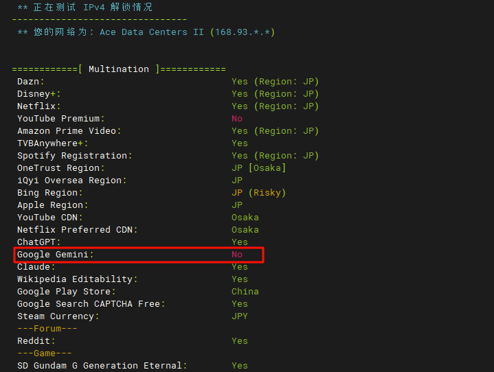
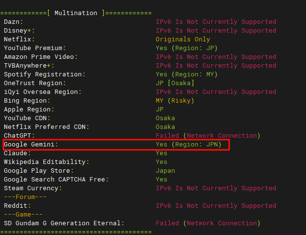

不知道怎么回事，突然某天开始通过 Osaka 的代理就无法访问 Google Gemini, Google Jules 等服务了，访问 `google.com` 就会被重定向到 `google.cn`。
毫无疑问，这就是代理服务器的 IP 被谷歌标记为了中国 IP，也就是俗称的“送中”。

解决这个问题最简单的方法就是换一个 IP，于是我向客服 （服务器是 Evoxt 家的）申请更换一个 IPv4 地址。然而在我更换之后，运行脚本 `bash <(curl -L -s https://git.io/JRw8R)`，结果如下图：



仍然没有解锁，看来是这一段 IP 都被标记了，这也就说通了为什么我们没有给谷歌打开任何的定位权限，还是被送中了——有一些人犯蠢了，害得整个 IP 段都没得用。
然而还好我顺带和客服申请了一个 IPv6 地址，测试结果如图：



太好啦！这意味着我只要让代理用它的 IPv6 网卡出站 Google 流量就可以了！
于是我马上开始配置 Sing-Box :

```json
{
  "outbounds": [
    {
      "tag": "direct6",
      "type": "direct",
      "bind_interface": "eth0",
      "inet6_bind_address": "..."
    }
  ],
  "route": {
    "rules": [
      {
        "domain_suffix": [".google.com"],
        "action": "route",
        "outbound": "direct6"
      }
    ]
  }
}
```

但是没有效果，我不断检查配置的正确性、有效性以及运行日志，始终不行...
因为我错误理解了 Sing-Box 的运作方式，代理服务器根本就不知道你要访问哪个域名，因为它不负责 DNS 解析，DNS 解析早在 Sing-Box 客户端就已经完成了。
所以应当在 Sing-Box 客户端配置 `"domain_strategy": "prefer_ipv6"` ，这样你的客户端就会解析到 `gemini.google.com` 的 IPv6 地址，然后客户端再告诉代理服务器它要向 IPv6 地址通信，代理服务器自然而然会使用 IPv6 出站，因为这是个 IPv6 的包呀。

## Takeaways

- 运行 `bash <(curl -L -s https://git.io/JRw8R)` 可以测试代理对各种服务的解锁情况
- 代理的 DNS 解析是在客户端完成的，服务端并不知道你在访问哪个域名
