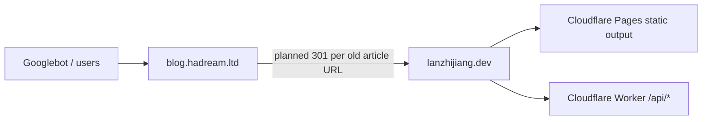

# SEO Migration Audit

Date: 2026-05-27

Scope:

- Source site: `https://blog.hadream.ltd`
- Target site: `https://lanzhijiang.dev`
- Goal: minimal SEO migration.
- Explicitly out of scope for this pass: Open Graph, Twitter Card, and Article JSON-LD.

## Verified Topology

## Old Site Facts

- SSH host: `websp.hadream.local`
- SSH user observed: `yyh`
- SSH user has `wheel`, but no passwordless sudo.
- Site stack: AMH LNMP, Nginx 1.18 origin vhost behind public Nginx 1.24.
- Typecho root: `/home/wwwroot/lnmp1/domain/lanblog/web`
- Vhost config: `/home/wwwroot/lnmp1/vhost/lanblog.conf`
- Vhost server names: `blog.hadream.ltd`, `blog.hadream.local`
- Vhost origin listen port: `81`
- Current article URL shape: `/index.php/archives/<id>/`
- Current standalone page URL shape: `/index.php/<slug>.html`
- Public RSS: `https://blog.hadream.ltd/index.php/feed/`
- Public Typecho search cache: `https://blog.hadream.ltd/usr/plugins/ExSearch/cache/cache-c315aab01aa8a05c8f1a3f64bbba792c.json`
- Old Typecho search cache contains 81 posts.
- Old site has no public `/sitemap.xml`.
- Old site has no public `/robots.txt`.
- Old Google Search Console verification file exists: `google0082311ca71e0e82.html`.

SSH host key fingerprints captured in isolated known hosts:

- RSA: `SHA256:nQ7RfEd2LhcT2HF9l0yyBGMvWoQQD/ViUmz805e13s4`
- ECDSA: `SHA256:ufR4smT3wwPgwQFDK6VGgeKEgjYRjFYtl96Es9Ufbr0`
- ED25519: `SHA256:0etZa0om9um03CSu7d0OZBy6oyaZxa+vFL8heSj1Afs`

## Old Site Google Facts

- GA4 measurement id found in theme files: `G-YWCF96M53T`

## New Site Facts

- Local article files: 89.
- Local articles with `oldUrl`: 81.
- Old Typecho posts missing in local frontmatter: 0.
- Local `oldUrl` entries missing from old Typecho search cache: 0.
- Local-only articles without old URL: 8.
- Existing new sitemap route exists in `src/ssg/app.ts`.
- Existing new RSS route exists in `src/ssg/app.ts`.
- Existing sitemap contains `/`, `/about`, and all `/article/<slug>` paths.
- `siteConfig.origin` defaults to `https://lanzhijiang.dev`.
- HTML layout currently emits only basic SEO head fields:
  - charset
  - viewport
  - title
- HTML layout currently does not emit:
  - canonical URL
  - meta description
  - Google verification meta/file route
- Target public `/google0082311ca71e0e82.html` currently returns the home HTML fallback, not the verification file.
- Target public `/robots.txt` is affected by Cloudflare Managed Content and then the static fallback HTML; this should be replaced by an explicit static `robots.txt`.

## URL Inventory

Generated artifacts:

- `tasks/seo-ads-migration/old-url-map.csv`
- `tasks/seo-ads-migration/url-inventory-diff.md`
- `tasks/seo-ads-migration/nginx-article-redirects.conf`
- `tasks/seo-ads-migration/nginx-rewrite-redirects.conf`
- `tasks/seo-ads-migration/scripts/extract-url-map.mjs`
- `tasks/seo-ads-migration/scripts/generate-nginx-redirects.mjs`
- `tasks/seo-ads-migration/scripts/generate-nginx-rewrites.mjs`
- `tasks/seo-ads-migration/scripts/apply-remote-nginx-rewrites.sh`

The redirect inventory has 81 article redirects and a clean diff against the old Typecho search cache.
