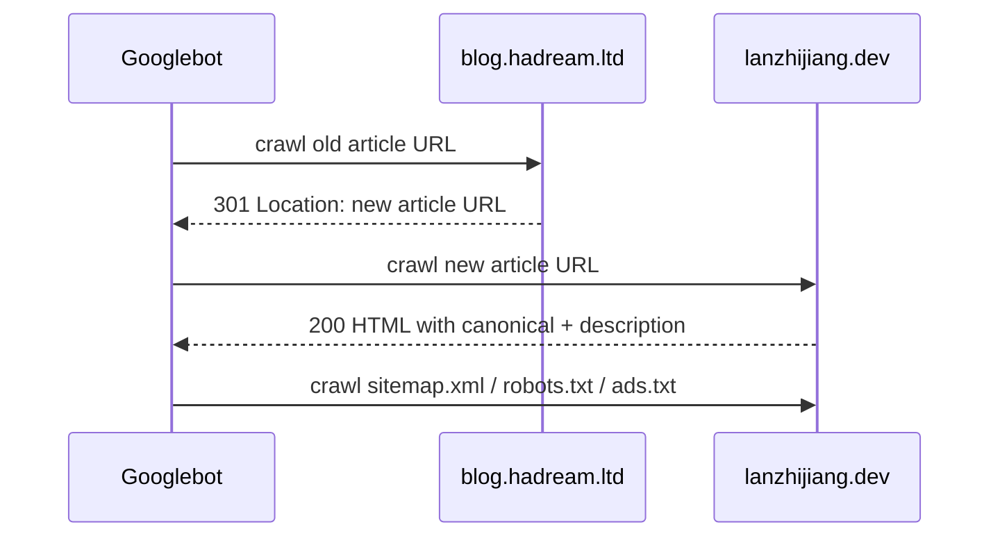

# Minimal Migration Plan

This plan intentionally excludes Open Graph, Twitter Card, and Article JSON-LD.

## Sequence



## Target Site Minimum Changes

1. Add explicit `public/robots.txt`.
   - Allow search crawlers.
   - Include `Sitemap: https://lanzhijiang.dev/sitemap.xml`.
   - Avoid appending fallback HTML.

2. Add explicit `public/ads.txt`.
   - Content: `google.com, pub-2521214392427276, DIRECT, f08c47fec0942fa0`

3. Add Google verification file or meta.
   - Existing old verification file: `google0082311ca71e0e82.html`
   - The fastest low-risk path is adding the same file under `public/`.

4. Add minimal head metadata to layout.
   - Per page canonical URL.
   - Per page meta description.
   - Keep this generic and data-driven from existing article frontmatter.

5. Add AdSense script only after the new domain is added in AdSense.
   - Prefer production-only emission.
   - Reuse publisher id `ca-pub-2521214392427276`.
   - Reuse in-article slot `9572303576` only if the content placement remains article-only.

## Old Site Minimum Changes

1. Keep old site available long enough to serve redirects.
2. Add exact 301 redirects for all 81 article URLs in `old-url-map.csv`.
3. Add redirects for the old standalone pages:
   - `/index.php/about-page.html` -> `https://lanzhijiang.dev/about`
   - `/index.php/sub_blog.html` -> likely `https://lanzhijiang.dev/` unless a new equivalent page is planned.
4. Redirect old feed:
   - `/index.php/feed/` -> `https://lanzhijiang.dev/rss.xml`
5. Do not redirect every unknown old URL to the homepage.
   - Let truly missing URLs remain 404, or map only high-value category/tag archive pages to useful equivalents.

## Verification Commands

```bash
curl -I https://lanzhijiang.dev/sitemap.xml
curl -I https://lanzhijiang.dev/robots.txt
curl -I https://lanzhijiang.dev/ads.txt
curl -I https://lanzhijiang.dev/google0082311ca71e0e82.html
curl -I https://blog.hadream.ltd/index.php/archives/451/
```

After redirects are deployed, expected old article response:

```txt
HTTP/2 301
location: https://lanzhijiang.dev/article/key-based-ssh-auth
```

## Google Console / AdSense Manual Steps

1. Verify both old and new properties in Google Search Console.
2. Submit `https://lanzhijiang.dev/sitemap.xml`.
3. Use Search Console Change of Address after old redirects are live.
4. Add `lanzhijiang.dev` as a new AdSense site.
5. Wait for AdSense site review before relying on ad fill.

